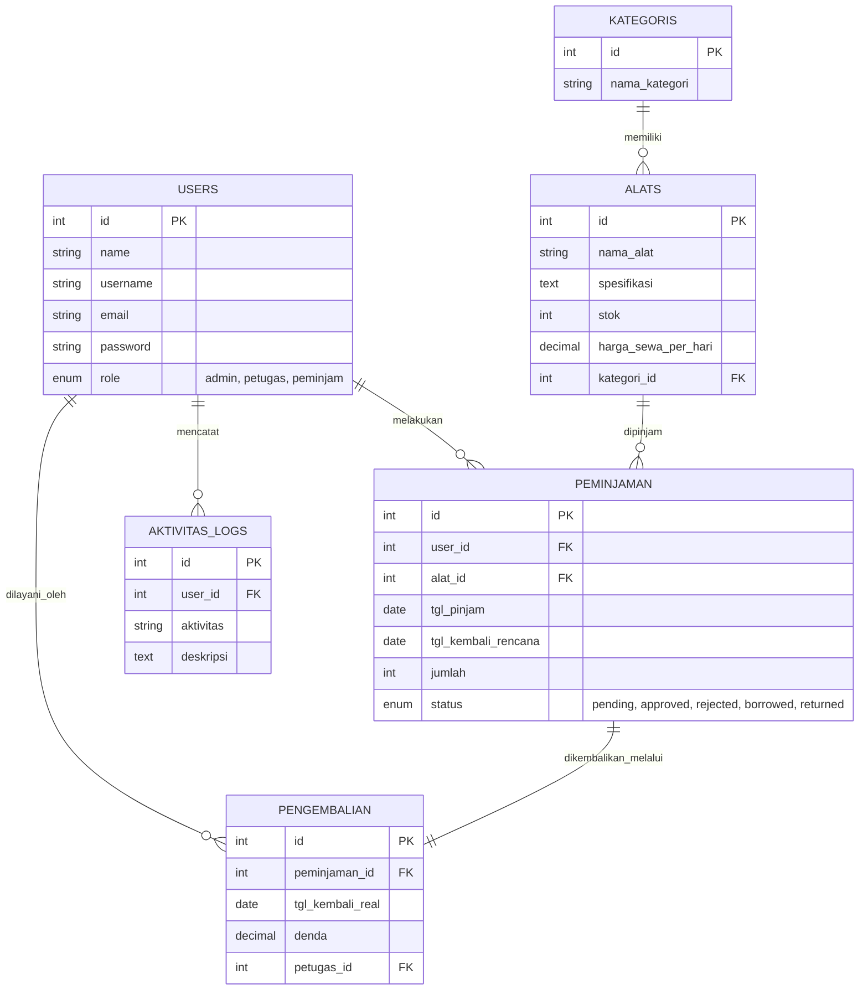

# ERD - Aplikasi Peminjaman Alat

```mermaid
erDiagram
    USERS ||--o{ PEMINJAMAN : "melakukan"
    USERS ||--o{ PENGEMBALIAN : "dilayani_oleh"
    KATEGORIS ||--o{ ALATS : "memiliki"
    ALATS ||--o{ PEMINJAMAN : "dipinjam"
    PEMINJAMAN ||--|| PENGEMBALIAN : "dikembalikan_melalui"
    USERS ||--o{ AKTIVITAS_LOGS : "mencatat"

    USERS {
        int id PK
        string name
        string username
        string email
        string password
        enum role "admin, petugas, peminjam"
    }

    KATEGORIS {
        int id PK
        string nama_kategori
    }

    ALATS {
        int id PK
        string nama_alat
        text spesifikasi
        int stok
        decimal harga_sewa_per_hari
        int kategori_id FK
    }

    PEMINJAMAN {
        int id PK
        int user_id FK
        int alat_id FK
        date tgl_pinjam
        date tgl_kembali_rencana
        int jumlah
        enum status "pending, approved, rejected, borrowed, returned"
    }

    PENGEMBALIAN {
        int id PK
        int peminjaman_id FK
        date tgl_kembali_real
        decimal denda
        int petugas_id FK
    }

    AKTIVITAS_LOGS {
        int id PK
        int user_id FK
        string aktivitas
        text deskripsi
    }
```
